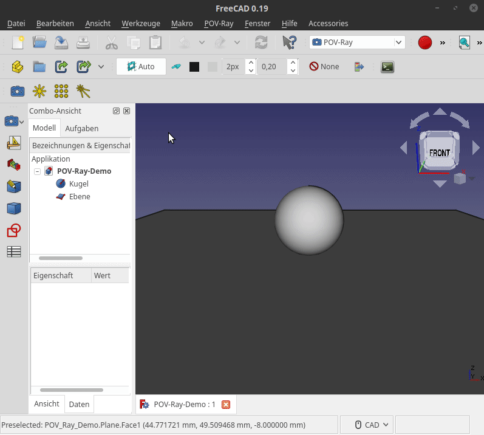

# Workbench for Rendering a FreeCAD model with POV-Ray

**With this workbench you will be able to create photorealistic pictures of your model easily, even if you're a beginner in raytracing. If you're an advanced users with more knowledge, you can get the full control about all detailed settings.**

## Features

* easy applying of textures including a preview
* easy inserting and configuration of different types of lights
* easy use of indirect lightning to create realistic images  
  **⇨ simple handling and operation**
* power users can get the full control about the whole configuration with the user inc file (see [Power Users](doc/PowerUser.md))  
  **⇨ offering all settings for advanced users**
* the model is not converted into meshes, the model will be converted into a mathematical way of describing the object shape, so you will get a better object and a better picture
* very good readability of the created files → easy editing of these files
* WYSIWYG - You can pan your model and render and you will get this point of view from FreeCAD

## Installation

**Automatic Installation**  
The recommended way of installing this workbench is to use the addon manager (Tools / Addon Manager). In the addon manager in the workbenches tab, select the POV-Ray-Workbench and click install.

**Install POV-Ray**  
In the background, POV-Ray is used to create the images. So you have to install POV-Ray too:
For Windows users, the installer can be downloaded from [POV-Ray Download Page](https://www.povray.org/download/), for Linux users it can usually be installed from the package manager. Look up the detailed instructions in the [POV-Ray Wiki](https://wiki.povray.org/content/HowTo:Install_POV) if you're on a Mac.

**Set the POV-Ray Executable Path**  
After installing POV-Ray, you have to tell the workbench, where you installed POV-Ray. To do this, go into the POV-Ray workbench and go to Edit/Preferences/POV-Ray. Under "POV-Ray Executable" you can define where you installed POV-Ray. Usually, this are the default paths:
- **Windows:** `C:/Program Files/POV-Ray/v3.7/bin/pvengine64.exe`
- **Linux:** `/usr/bin/povray`
- **MacOS:** if you know, please let us know, since I have no Mac to look up the path

After that, restart FreeCAD and have fun with our workbench :)

## Usage

### Get your first image

1. open your model you want to render
2. go to the POV-Ray workbench
3. click on , after that a dialog should appear
4. click on the "..." button to select, where you want to store the ini file (something like a project file), all other files that are created during the rendering process will be also stored there
5. the following settings will be good for initial render:
  
   * Width: 800px
   * Height: 600px
   * [x] Export FreeCAD Background
   * [x] Export FreeCAD Light
   * [ ] Repair Rotation
   * [ ] Export FreeCAD View
  
6. press "Start Render"
7. depending on the complexity of the model it can take a while until a window appears, where you see how the rendered image is growing until the rendering process is finished. To close the rendering window click in the middle of the image.
8. go into the folder you selected, there you will find all files including the image

The rendered image will look nearly the same than the FreeCAD view. The following steps will change this dramatically:

### Add textures

Adding Textures is easy: Go to the dialog window again and switch to the texture tab. In the left list you will find all objects to which you can apply textures. **First** select an object in the left list. **Second** select a texture in the right list. These two steps can be repeated.
Start the rendering again.

### Add lights

Lights are Objects and can be added via the workbench. You can move them to the desired position as you are used to do with other FreeCAD objects.
Want to know more about lights? Look in the [Light properties chapter](doc/LightProperties.md). The effects of light to your scene are explained in [Realistic.md](doc/Realistic.md).

## Wiki

The workbench have a lot of features that cannot explained all in the README. So we created a wiki with tutorials and a explanation of all features: [POV-Ray Workbench Wiki](doc/)
The FreeCAD Wiki page is here: [POV-Ray Workbench Wiki](https://wiki.freecad.org/POV-Ray-Rendering_Workbench)

## Forum Thread

We have a thread in the FreeCAD Forum about this workbench. You can ask question there, give feedback, report bugs, etc.:  
[New Raytracing Workbench for POV-Ray](https://forum.freecad.org/viewtopic.php?f=9&t=48629)

## Idea of the Workbench on Contrast to others

In contrast to the other rendering solutions of FreeCAD we are focused on using POV-Ray as the only renderer. We decided to support only one renderer, but that one as good as possible. If you implement several renderers like the Render Workbench, you always have to do compromises and therefore less detailed settings. In addition, this workbench exports a mathematically perfect representation of the model and use meshes only if the used feature isn't fully supported (the number of supported objects is growing constantly; see [Supported Objects](doc/Supported.md).

## License

We're using the GLGPL2+ license, see [LICENSE.md](LICENSE.md) for details.
