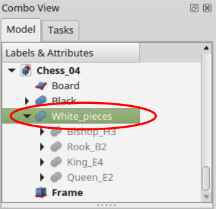

# Quick start
## Installation of the macro
The easiest way is to install it via the **Addon Manager** under Tools / Addon Manager / Macros.  
Alternative you can download the macro via [Macro Recipes](https://freecadweb.org/wiki/Macros_recipes) or download it directly from our [Gitlab Repository](https://gitlab.com/usbhub/exporttopovray) with the blue button top right to get the most actual version.  
Now you have to put the .FCMacro file in your macro directory. You can look under Edit / Preferences / General / Macro for your path.

## Installation of POV-Ray

* Linux - we recommend the installation with the Application Manager
* Windows - Get the Windows installer from the [POV-Ray website](http://www.povray.org/download/)

## POV-Ray executable Path and options

The macro must know how to find the POV-Ray executable. The path will be taken from the settings of either the raytracing workbench or the render workbench.
To reach the raytracing settings menu you must load the raytracing workbench first and second go to the settings menu.
The name of the POV-Ray executable is different in Windows and Linux:

* povray.exe (Linux)
* pvengine.exe (Windows)

It is important to write the hole path into the textfield for example (standard paths):

* /usr/bin/povray (Linux)
* ???

For the executable options in the next field you should take

* +P +A

+P causes POV-Ray to show the rendered image.
+A is for Antialiasing - this is optional.

If the raytracing workbench works with these settings, the macro should do also.

## Usage
Create a model with the part workbench.
The macro takes your actual view on the model, so pan your view how you would like the rendering. Now you can [Start the Macro](#startTheMacro). After that, select / create the file where you want to save the POV-ray code. Now the macro creates the POVray code and start the POVray. If you have many no CSG object the creation of the code can take a while. POV-ray opens a windows with the rendering result. To close this window, click on the window.

<a name="startTheMacro"></a>
## Start the Macro
Go to Macro/Macros… and start the installed macro by double clicking on it.

## Make changes

To use the full power of POV-Ray you can add textures, lights, athmosperic effects and many more to your model.
For this you have to create an include file manually with the same name as the pov file in directory of your pov file. Change the extension to `.inc`.  
For example
```
pov file: myPOVrayFile.pov
inc file: myPOVrayFile.inc
```
You should define all additional features in the include file. It will not be overwritten by the macro.

### Add textures and material
Be aware to use the right syntax if you want to define a texture for a specific object.  
For example if you want to add the material `M_Glass3` to an object, labeled with `White_pieces` in the object tree,



you have to type this in your inc file:

```
#declare White_pieces_material = material { M_Glass3 }

```
It is also important to take care of the material hierarchy because POV-Ray will generate an error message

### Add objects
If you want to add POV-ray objects (e.g. another lamp, a special background or any other object) you can do this also with the .inc file. Just add the POV-ray object to the .inc file and restart the macro. Now POV-ray also renders your own object which is defined in the inc file.  
The macro will comment out the camera if you define your own.
FreeCAD light and background can be switched off in the dialog box if you define your own one.

### Change global settings

There are several ways to influence the way and quality of rendering.
For example you can add a global ambient light:

```
global_settings { ambient_light rgb<1, 0, 0> }
```

or if you want to use [radiosity](https://en.wikipedia.org/wiki/Radiosity_(computer_graphics)) in your rendering, you can add this information in the inc file.  
```
#include "rad_def.inc"
global_settings {
   radiosity {
      Rad_Settings(MODE, off, off)
   }
}
```
Replace MODE with the one of the modes described in [POVray wiki](http://wiki.povray.org/content/HowTo:Use_radiosity).
